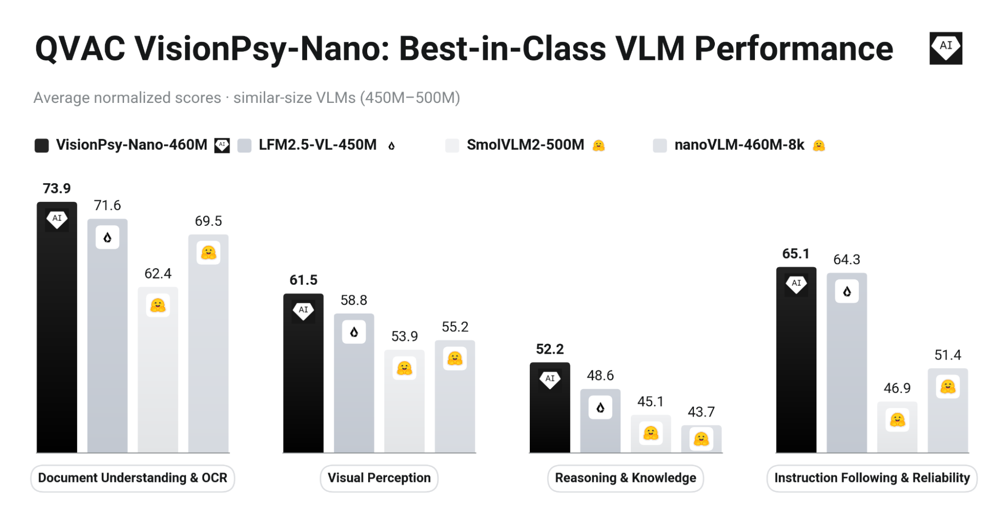
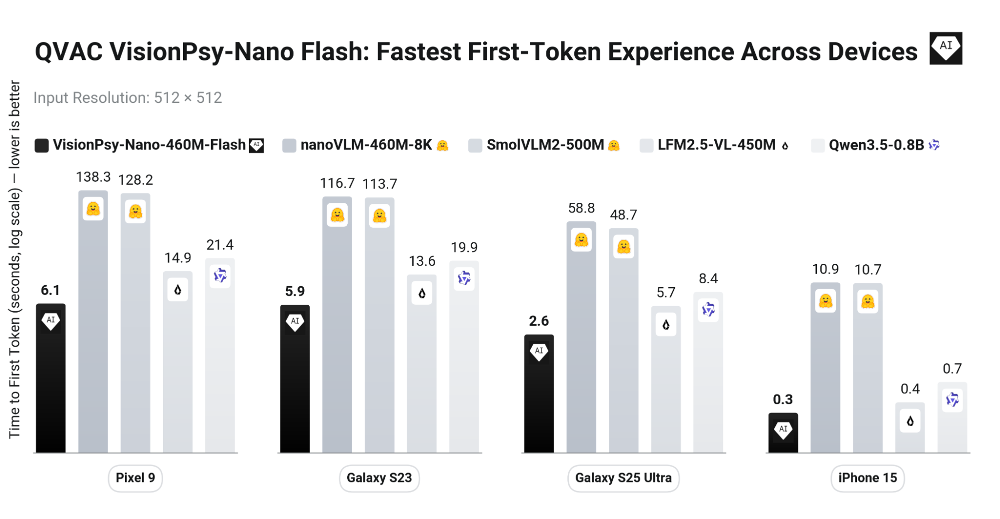
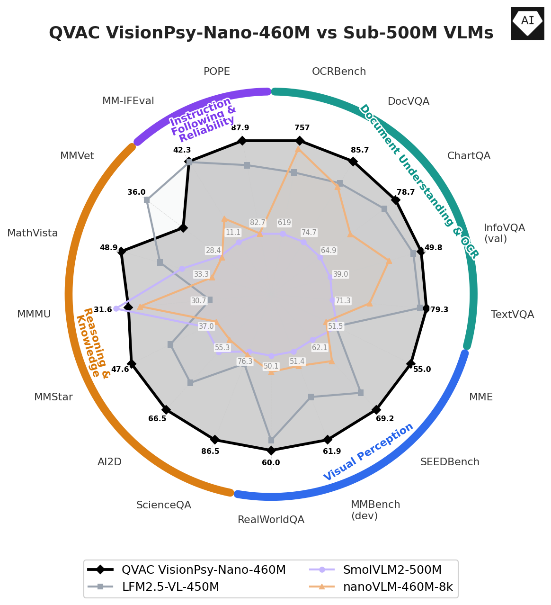

<p align="center">
  
  
  
  
</p>

<h1 align="center">VisionPsy Nano</h1>

<div align="center">
  <b>A tiny (~460M) vision-language model that runs on the device in your pocket</b><br>
  <b>Best-in-class quality at ~0.5B • Reads documents, understands scenes, reasons, follows instructions</b>
</div>

<p align="center">
  <a href="https://huggingface.co/blog/qvac/visionpsy">📝 Blog</a> •
  <a href="#-what-can-it-do">Capabilities</a> •
  <a href="#-models">Models</a> •
  <a href="#-benchmarks">Benchmarks</a> •
  <a href="#-quick-start">Quick Start</a> •
  <a href="#-model-details">Model Details</a> •
  <a href="#-repository-structure">Repository Structure</a> •
  <a href="#-usage-examples">Usage Examples</a> •
  <a href="#-requirements-at-a-glance">Requirements</a> •
  <a href="#-troubleshooting">Troubleshooting</a> •
  <a href="#-license">License</a>
</p>

<p align="center">
  
</p>

<div align="center">
  <i>VisionPsy-Nano-460M leads its ~0.5B weight class across all four capability areas.</i>
</div>

---

## 🎯 What Can It Do?

**VisionPsy Nano** takes an image and a question and gives you an answer, small enough to run
on a phone, accurate enough to be useful. It is strong across four everyday capability areas:

### 📄 Document Understanding & OCR
Read and reason over text-heavy images: receipts, invoices, forms, IDs, charts, and screenshots.

> *Practical uses:* pull the total and line items off a receipt, extract fields from a scanned
> form, answer "what was Q3 revenue?" from a chart, read a nutrition label or a street sign,
> transcribe a menu or a whiteboard.

### 👁️ Visual Perception
Understand real-world scenes: objects, attributes, counts, and spatial relationships.

> *Practical uses:* describe a photo for accessibility, "how many people are in this picture?",
> "what is the object to the left of the laptop?", check whether a shelf is empty, caption
> camera images.

### 🧠 Reasoning & Knowledge
Interpret diagrams and figures, do light visual math, and answer knowledge-grounded questions.

> *Practical uses:* help a student with a textbook science diagram, solve a chart- or
> plot-based math question, explain what a flowchart shows, identify a landmark and say something
> about it.

### ✅ Instruction Following & Reliability
Follow output-format instructions and stay grounded in what's actually in the image.

> *Practical uses:* "return the answer as JSON", "reply in one word", "list *every* item you
> see", while avoiding making up objects that aren't there (low hallucination).

---

## 📦 Models

The official model weights are released on the Hugging Face Hub:

| Model | What it's for | Link |
|-------|---------------|------|
| 🏆 **VisionPsy-Nano-460M** | **Best quality**: the top ~0.5B VLM in its class | [huggingface.co/qvac/VisionPsy-Nano-460M](https://huggingface.co/qvac/VisionPsy-Nano-460M) |
| ⚡ **VisionPsy-Nano-460M-Flash** | **Best latency**: 10-25× faster time-to-first-token on real phones, ~99% of the quality | [huggingface.co/qvac/VisionPsy-Nano-460M-Flash](https://huggingface.co/qvac/VisionPsy-Nano-460M-Flash) |
| 🪶 **GGUF builds** (both models) | **On-device / llama.cpp**: fp32 down to 3-bit quantizations | [Nano-GGUFs](https://huggingface.co/qvac/VisionPsy-Nano-460M-GGUFs) · [Flash-GGUFs](https://huggingface.co/qvac/VisionPsy-Nano-460M-Flash-GGUFs) |

Both are ~460M parameters, Apache 2.0 licensed, and built on the
[nanoVLM](https://github.com/huggingface/nanoVLM) architecture. Flash uses more aggressive
visual-token compression, squeezing each image to as few as **64 visual tokens** for dramatically
faster, lower-memory inference on constrained hardware, while retaining ~99% of the full model's
quality. A 4-bit (Q4_0) **GGUF** build of Flash is available for on-device
[llama.cpp](llama-cpp-inference/) runtimes.

<p align="center">
  
</p>

<div align="center">
  <i>Flash reaches the first token 10-25× faster than nanoVLM-460M and SmolVLM2-500M on real phones (512×512 input, lower is better).</i>
</div>

---

## 📊 Benchmarks

We evaluated VisionPsy Nano on **17 public benchmarks** across the four capability areas above,
all scored in a single [VLMEvalKit](https://github.com/open-compass/VLMEvalKit) harness so every
model is measured identically (LLM-as-judge scoring uses Qwen3.6-27B).

**VisionPsy-Nano-460M compares favourably to every other ~0.5B VLM tested**, including
LFM2.5-VL-450M, SmolVLM2-500M, and its own nanoVLM-460M-8k base, **on 16 of 17 benchmarks**, with
a leading **overall normalized score of 62.3** (vs 59.6 / 52.5 / 54.9). Scores are normalized to
0-100 (higher is better).

<p align="center">
  
</p>

<div align="center">
  <i>Per-benchmark comparison across all 17 evaluations: VisionPsy-Nano-460M (black) compares favourably on 16 of 17 benchmarks.</i>
</div>

| Capability area | Benchmarks | VisionPsy-Nano-460M | LFM2.5-VL-450M | SmolVLM2-500M | nanoVLM-460M-8k |
|-----------------|-----------|:-------------------:|:--------------:|:-------------:|:---------------:|
| 📄 Document Understanding & OCR | OCRBench, DocVQA, ChartQA, InfoVQA, TextVQA | **73.9** | 71.6 | 62.4 | 69.5 |
| 👁️ Visual Perception | MME, SEEDBench, MMBench, RealWorldQA | **61.5** | 58.8 | 53.9 | 55.2 |
| 🧠 Reasoning & Knowledge | ScienceQA, AI2D, MMStar, MMMU, MathVista, MMVet | **52.2** | 48.6 | 45.1 | 43.7 |
| ✅ Instruction Following & Reliability | MM-IFEval, POPE | **65.1** | 64.3 | 46.9 | 51.4 |

**Punching above its weight.** At roughly half to two-thirds the parameters, VisionPsy-Nano-460M
beats larger 0.75-1B models (FastVLM-0.5B, Qwen3.5-0.8B, InternVL3.5-1B) outright on
**ScienceQA (86.5)**, **MM-IFEval (42.3)**, and **POPE (87.9)**.

> 📈 Full per-benchmark tables, on-device latency numbers, and methodology are in the
> [VisionPsy-Nano blog post](https://huggingface.co/blog/qvac/visionpsy).

---

## 🚀 Quick Start

This repository provides everything to **run inference** with VisionPsy Nano across three
interchangeable runtimes. Pick the one that fits your goal:

| Runtime | Best for | Format | Directory |
|---------|----------|--------|-----------|
| 🤗 **Transformers** | Reference results, research, easy hacking | `safetensors` (HF Hub) | [`hf-inference/`](hf-inference/) |
| ⚡ **vLLM** | High-throughput serving, OpenAI-compatible API | `safetensors` (HF Hub) | [`vllm-inference/`](vllm-inference/) |
| 🪶 **llama.cpp** | On-device / edge, minimal deps, quantized GGUF | `GGUF` | [`llama-cpp-inference/`](llama-cpp-inference/) |

```bash
git clone https://github.com/tether-ai-research/qvac-visionpsy-nano.git
cd qvac-visionpsy-nano
```

<details open>
<summary><b>🤗 Transformers (reference, easiest)</b></summary>

Requires Python ≥ 3.10 and PyTorch ≥ 2.4 (CUDA GPU recommended; CPU works, slower).

```bash
cd hf-inference
pip install -r requirements.txt

# One-shot image + prompt inference (downloads the checkpoint from the Hub)
python usage_inference.py --deploy --device cuda
```

Or use it directly from the standard Transformers API (works on GPU or CPU):

```python
import torch
from PIL import Image
from transformers import AutoModelForImageTextToText, AutoProcessor

repo = "qvac/VisionPsy-Nano-460M"  # or qvac/VisionPsy-Nano-460M-Flash
device = "cuda" if torch.cuda.is_available() else "cpu"

model = AutoModelForImageTextToText.from_pretrained(
    repo,
    trust_remote_code=True,
    dtype="auto" if device == "cuda" else torch.float32,
).to(device).eval()
processor = AutoProcessor.from_pretrained(repo, trust_remote_code=True)

# apply_deploy_profile() enables torch.compile + CUDA graphs (fastest on GPU);
# use apply_eager_profile() for plain eager execution or CPU.
if device == "cuda":
    model.apply_deploy_profile(model.device)
else:
    model.apply_eager_profile()

# The processor applies the chat template and inserts image tokens for you,
# so just pass the raw image(s) and a plain-text prompt.
image = Image.open("your_image.jpg").convert("RGB")
inputs = processor(images=image, text="What is in this image?", return_tensors="pt")
inputs = {
    k: (v.to(device) if torch.is_tensor(v) else v)
    for k, v in inputs.items()
    if v is not None
}
inputs.pop("pixel_values", None)

with torch.inference_mode():
    out = model.generate(**inputs, max_new_tokens=128, greedy=True)
print(processor.batch_decode(out, skip_special_tokens=True)[0].strip())
```

**Example**: run the snippet on the performance chart at the top of this README
(`assets/hero_performance.png`):

<p align="center">
  
</p>

```text
Prompt:  What is the main takeaway of this chart?
Output:  The chart compares the average normalized scores of different VLM models on four
         categories: Document Understanding & OCR, Visual Perception, Reasoning & Knowledge,
         and Instruction Following & Reliability. It shows that the VisionPsy-Nano-460M model
         has the highest scores in all four categories, indicating it performs best in these
         areas.
```

**📖 [Full Transformers guide](./hf-inference/README.md)**

</details>

<details>
<summary><b>⚡ vLLM (high-throughput serving)</b></summary>

Requires Python ≥ 3.10 and a CUDA GPU.

```bash
cd vllm-inference

# Create a venv with vLLM + the VisionPsy out-of-tree plugin
./scripts/setup.sh
source .venv/bin/activate

# One-shot inference (loads qvac/VisionPsy-Nano-460M from the Hub)
bash scripts/infer.sh

# Or start an OpenAI-compatible server on :8900 (model name "visionpsy-nano")
bash scripts/serve.sh
```

The plugin auto-registers the VisionPsy architecture, so the checkpoint also works with the
plain vLLM Python API (`from vllm import LLM; LLM(model="qvac/VisionPsy-Nano-460M", dtype="float32")`).

**📖 [Full vLLM guide](./vllm-inference/README.md)**

</details>

<details>
<summary><b>🪶 llama.cpp (GGUF, on-device / edge)</b></summary>

Requires a CUDA GPU with `nvcc` to build the patched llama.cpp fork.

```bash
cd llama-cpp-inference

# 1. Download the GGUF weights into models/nano/ — see llama-cpp-inference/README.md
#    for the Hub repos and commands
#    models/nano/lm.gguf       (language model)
#    models/nano/mmproj.gguf   (vision projector)

# 2. Build (H100 by default; use CUDA_ARCH=80 for A100)
./scripts/build.sh

# 3. Run one-shot inference
bash scripts/infer.sh
```

**📖 [Full llama.cpp guide](./llama-cpp-inference/README.md)**

</details>

All three runtimes print a short image description under a `---- model output ----` banner from
their `infer.sh` scripts, so you can compare them on the same image and prompt.

---

## 🧠 Model Details

VisionPsy Nano is a ~460M-parameter vision-language model built on the
[nanoVLM](https://github.com/huggingface/nanoVLM) architecture: a SigLIP2 vision encoder paired
with a SmolLM2 language backbone through a lightweight pixel-shuffle connector.

| Component | Choice |
|-----------|--------|
| Vision encoder | SigLIP2 (`google/siglip2-base-patch16-512`), 512×512 input, patch size 16 |
| Language model | SmolLM2-360M-Instruct (32 layers, hidden dim 960, GQA with 15/5 heads) |
| Modality projector | Pixel-shuffle (factor 4) → 64 image tokens per 512×512 tile |
| Context length | up to 8192 tokens |
| Precision | float32 (Flash also ships as 4-bit Q4_0 GGUF) |
| Chat template | ChatML (`<\|im_start\|>` / `<\|im_end\|>`) |

**Single-image by design.** The model is trained and optimized for one image per query
(camera Q&A, document/chart/scene understanding); multi-image prompts are outside its intended use.

### Image tiling

VisionPsy Nano processes images as one or more **512×512 tiles** plus a global view. Each tile
becomes 64 image tokens, and the prompt carries special position tokens
(`<|global_image|>`, `<row_R_col_C>`, `<|image|>`) that tell the model how tiles are laid out.

- The **Transformers** and **vLLM `infer.py`** paths handle tiling for you.
- The **vLLM server** expects **pre-tiled** images (one 512×512 tile per `image_url` item) and a
  prompt that already contains the position tokens; see
  [`vllm-inference/infer.py`](vllm-inference/infer.py) for the reference client-side preprocessing.

---

## 📁 Repository Structure

```
qvac-visionpsy-nano/
├── README.md                       # This file
├── assets/                         # Figures used in this README
│
├── hf-inference/                   # 🤗 HuggingFace Transformers reference runtime
│   ├── README.md                   # Transformers usage guide
│   ├── requirements.txt            # torch, transformers, torchvision, ...
│   ├── usage_inference.py          # One-shot inference (nano variant)
│   ├── usage_inference_flash.py    # One-shot inference (flash variant)
│   ├── runtime_profile.py          # Eager vs deploy (torch.compile + CUDA graphs)
│   ├── modeling_visionpsynano.py      # HF-compatible model definition
│   ├── configuration_visionpsynano.py # HF config
│   ├── processing_visionpsynano.py    # HF processor (image + text)
│   ├── hub_packaging.py            # Helpers to build a Hub-ready repo
│   ├── models/                     # Reference model implementation
│   │   ├── vision_transformer.py   # SigLIP2 vision encoder
│   │   ├── language_model.py       # SmolLM2 language model
│   │   ├── modality_projector.py   # Pixel-shuffle projector
│   │   ├── vision_language_model.py# Full VLM
│   │   └── config.py               # Architecture hyperparameters
│   ├── data/                       # Image processors, transforms, sample img.jpg
│   └── scripts/
│       └── package_hub_repo.py     # Package a checkpoint for the HF Hub
│
├── vllm-inference/                 # ⚡ vLLM out-of-tree plugin + serving
│   ├── README.md                   # vLLM usage guide
│   ├── pyproject.toml              # Registers the vllm.general_plugins entry point
│   ├── infer.py                    # Reference tiling → prompt → llm.generate
│   ├── visionpsy_vllm/             # The plugin package (auto-registered by vLLM)
│   └── scripts/
│       ├── setup.sh                # Create venv with vLLM + plugin
│       ├── infer.sh                # One-shot inference
│       ├── serve.sh                # OpenAI-compatible server (:8900)
│       └── config.sh               # Model id / defaults
│
└── llama-cpp-inference/            # 🪶 GGUF inference via patched llama.cpp
    ├── README.md                   # llama.cpp usage guide
    ├── llama.cpp-custom/           # Patched llama.cpp fork (multimodal CLI)
    ├── models/                     # Place lm.gguf + mmproj.gguf here
    │   └── README.md               # Weight placement instructions
    └── scripts/
        ├── build.sh                # Build llama-mtmd-cli (CUDA)
        ├── infer.sh                # One-shot image captioning
        └── config.sh               # Model name / defaults
```

---

## 🔧 Usage Examples

### Point any runtime at a custom checkpoint

The `infer.sh` scripts accept the checkpoint via the `CKPT` environment variable (an HF repo id or
a local folder in the same format):

```bash
# vLLM: use the flash variant instead of the default nano
CKPT=qvac/VisionPsy-Nano-460M-Flash bash vllm-inference/scripts/infer.sh
```

### Custom image and prompt

```bash
# Transformers
python hf-inference/usage_inference.py \
  --image path/to/image.jpg \
  --prompt "How many people are in this photo?" \
  --max-new-tokens 128

# vLLM
IMAGE=path/to/image.jpg PROMPT="Describe the scene." bash vllm-inference/scripts/infer.sh

# llama.cpp
IMAGE=path/to/image.jpg PROMPT="Describe the scene." bash llama-cpp-inference/scripts/infer.sh
```

### Query the vLLM server

```bash
bash vllm-inference/scripts/serve.sh   # starts on :8900, served model name "visionpsy-nano"
```

The server exposes an OpenAI-compatible `/v1/chat/completions` endpoint. Remember it expects
**pre-tiled** images and prompts that already carry the tile position tokens; see
[`vllm-inference/infer.py`](vllm-inference/infer.py) for how to build a valid request.

---

## 📦 Requirements at a Glance

| Runtime | Python | Hardware | Key dependencies |
|---------|--------|----------|------------------|
| Transformers | ≥ 3.10 | CUDA GPU (CPU works, slower) | `torch>=2.4`, `transformers>=4.46` |
| vLLM | ≥ 3.10 | CUDA GPU | `vllm==0.22.0` (default) + plugin |
| llama.cpp | n/a | CUDA GPU + `nvcc` to build | patched llama.cpp fork |

> For older CUDA drivers (CUDA 12.x) with vLLM, the default PyPI wheel targets a newer CUDA. Install the
> `+cu129` wheel from [vLLM's GitHub releases](https://github.com/vllm-project/vllm/releases/tag/v0.22.0) instead:
> `VLLM_PACKAGE=https://github.com/vllm-project/vllm/releases/download/v0.22.0/vllm-0.22.0+cu129-cp38-abi3-manylinux_2_28_x86_64.whl ./scripts/setup.sh`
> and match PyTorch to the same CUDA build:
> `pip install torch==2.11.0+cu129 torchvision==0.26.0+cu129 --extra-index-url https://download.pytorch.org/whl/cu129`

---

## 🐛 Troubleshooting

- **`vllm not found` / `vllm not importable`**: run `./scripts/setup.sh` and
  `source .venv/bin/activate` inside `vllm-inference/`.
- **`llama-mtmd-cli not found`**: run `./scripts/build.sh` in `llama-cpp-inference/` first.
- **CUDA backend / `IM2COL failed` errors (llama.cpp)**: check your GPU architecture and driver;
  on A100 build with `CUDA_ARCH=80 ./scripts/build.sh`.
- **`checkpoint dir has no config.json`**: a local `CKPT` folder must be a packaged VisionPsy repo;
  use `hf-inference/scripts/package_hub_repo.py` to create one, or pass an HF repo id.
- **Garbled output from the vLLM server**: the server needs pre-tiled images and position tokens;
  use the preprocessing in `vllm-inference/infer.py`.

---

## 📄 License

VisionPsy Nano is released under the **Apache 2.0** license by Tether AI Research. It is a
fine-tuned version of [nanoVLM-460M-8k](https://huggingface.co/lusxvr/nanoVLM-460M-8k) (MIT).
See the model cards for full dataset attributions, and the upstream projects
([nanoVLM](https://github.com/huggingface/nanoVLM),
[vLLM](https://github.com/vllm-project/vllm),
[llama.cpp](https://github.com/ggml-org/llama.cpp)) for their respective licenses.

---

<div align="center">
  <b>Capable, private, low-latency multimodal AI, small enough to run on the device in your pocket.</b>
</div>
